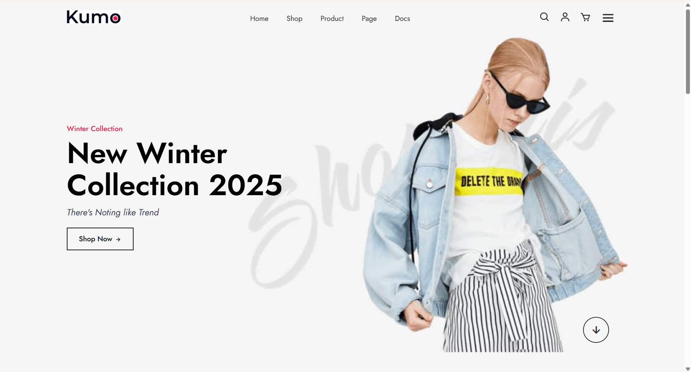

# Kumo E-commerce Website

A modern and responsive e-commerce frontend website for a fashion store.  
This project showcases a stylish online shop interface with product browsing and a clean user interface.

## Features
- Responsive design for desktop and mobile
- Modern homepage layout
- Product listing section
- Navigation menu
- Shopping cart icon interface
- Clean and minimal UI

## Technologies Used
- HTML5
- CSS3
- JavaScript

  ## Live Demo
**Live Website:**  
https://basmalawael043-dev.github.io/my-frontend-project

## Project Structure
index.html
css/
js/
images/
## Screenshots
Home page preview of the website interface.

## Purpose
This project was built as a frontend practice project to demonstrate skills in building responsive e-commerce website layouts.

## Author
Basmala Wael
